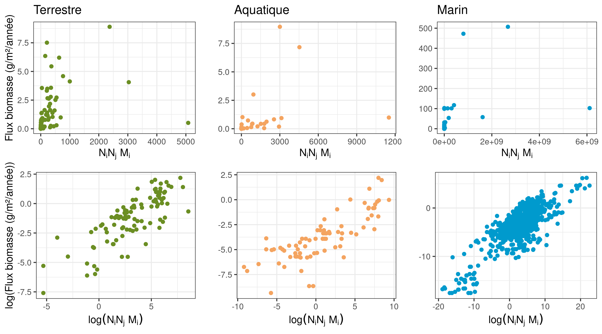

# Introduction
Blabla this is an introduction. This is a citation test @Brose2019PreTra, and this is also another citation test [@Brose2019PreTra]. 

# The data
The Ecopath data were obtain from @Jacquet2016NoCom on request to the corresponding author. Before manipulation, the data initially represented 116 Ecopath trophic networks. Ecopath is a modeling software which aims to quantify species interactions statically and is mass-balanced [@ChristensenEcoEco]. One weakness, if I may, is that a lot of these Ecopath networks are not taxonomically resolved to the species but encompass trophic groups or guilds. The first step here was then, for each of these networks, match the data to the original article from which they originated. This matching was done to 

Think about biases in the data. In the sense that we only have a subset on interaction networks, in which we took a subset of interactions (only those that had interactions with species resolved taxonomically to the species and not functional groups).

# Thoughts
Prey bodymasses can be smaller than their predators, for example: Canis lupus on Ovibos moschatus or even birds on Arctic hare. Prey abundances can also be higher than the predators, since we are taking the interactions out of the network context, this might not result in the prey disappearence sice the interactions might be of low strength. The dropping of plankton interactions is justified by the fact that lower trophic level in Ecopath are getting "boosted" to satisfy the mass-balancing, thus it can result in weird numbers in biomasses, production and resulting fluxes. Only keeping species-to-species interactions. 
# Figures

{#fig:figure}

{#fig:map}

# Analyses

# Conclusion